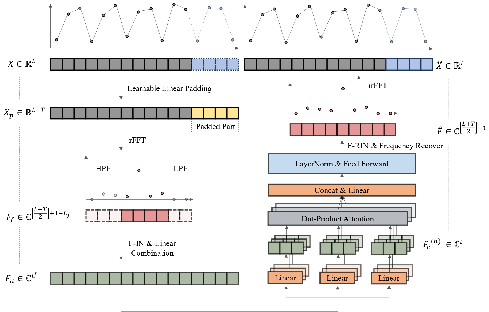
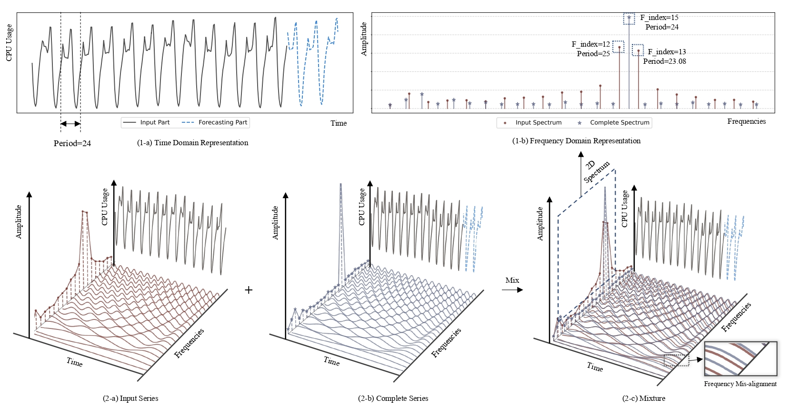

# Fremer

This is the official code repository of the paper: Fremer: Lightweight and Effective Frequency Transformer for Workload Forecasting in Cloud Services.

# Model Architecture

### The Frequency Resolution Mis-alignment Problem:

# Usage
1) Prepare the Data

https://huggingface.co/datasets/ByteDance/CloudTimeSeriesData

put the data under `./dataset/forecasting`

2) Run the Scripts under `./scripts/multivariate_forecast`

Coming soon ......

# Acknowledgement

Special thanks to TFB (https://github.com/decisionintelligence/TFB), which supports the evaluation part of this study.