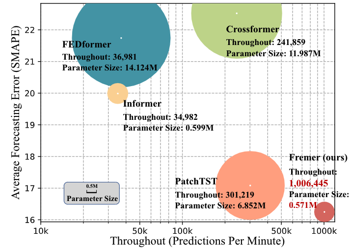
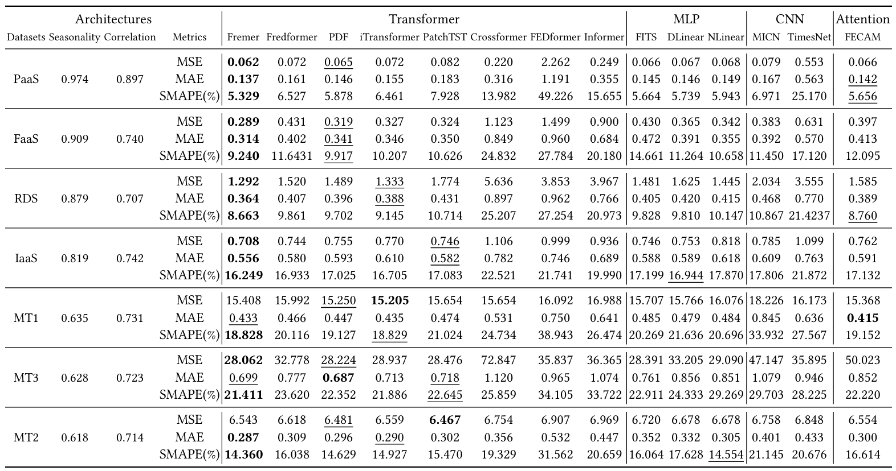

# Fremer (VLDB 2025 Paper)

Fremer: Lightweight and Effective Frequency Transformer for Workload Forecasting in Cloud Services.

# Performance

Comparison of throughput and prediction error
among different Transformers on IaaS workload dataset:



---

Forecasting results on distinct workload series datasets:



# Usage
1) Installation

Install the required dependencies using the following command:

```
pip install -r requirements.txt
```

2) Prepare the Data

- Download the dataset from https://drive.google.com/file/d/1vgpOmAygokoUt235piWKUjfwao6KwLv7/view?usp=drive_link provided by TFB. Then place the downloaded data under the folder `./dataset`.

- Obtained the ByteDance Workload Data from https://huggingface.co/datasets/ByteDance/CloudTimeSeriesData. Then put the data under `./dataset/forecasting`.

3) Run the Scripts under `./scripts/multivariate_forecast`

For example:

```
bash ./scripts/multivariate_forecast/RDS_script/Fremer.sh
```
# Citation

If you find this work useful, please cite our paper:
```
@article{ye2025fremer,
  title   = {Fremer: Lightweight and Effective Frequency Transformer for Workload Forecasting in Cloud Services},
  author  = {Hengyu Ye and Jiadong Chen and Fuxin Jiang and Xiao He and Tieying Zhang and Jianjun Chen and Xiaofeng Gao},
  journal = {Proceedings of the VLDB Endowment},
  volume  = {18},
  number  = {11},
  pages   = {3812--3825},
  year    = {2025}
}
```

# Acknowledgement

- We extend our gratitude to TFB (https://github.com/decisionintelligence/TFB) for their support in the evaluation phase of this study.

- This research is supported by **ByteDance**, and we deeply appreciate their contributions.
